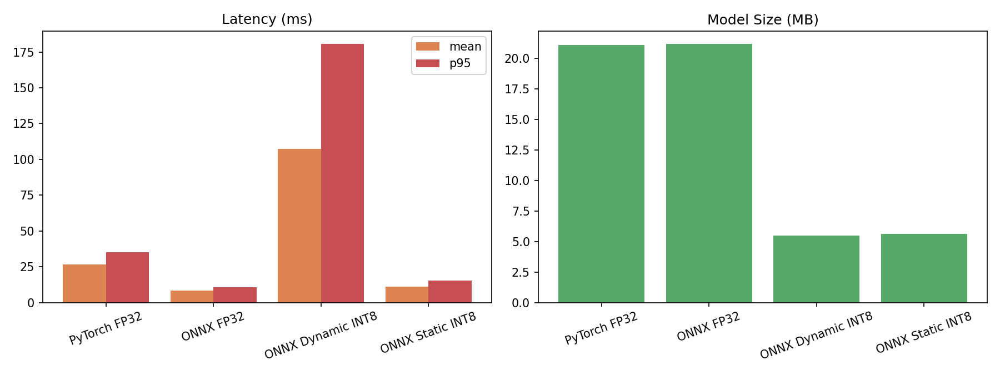
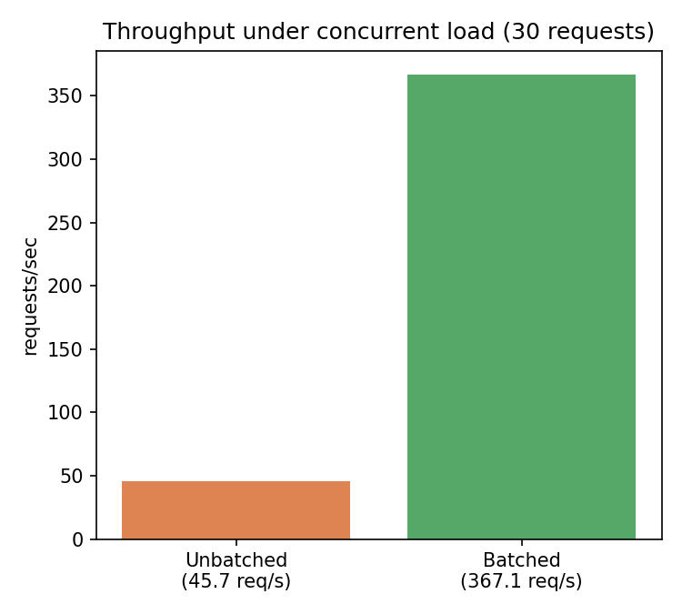

# MobileNetV3 Optimized Inference Server

Two-part optimization project on MobileNetV3-Large:
(1) model-level — ONNX export and dynamic vs. static INT8 quantization for a
CNN, and (2) systems-level — a FastAPI server with caching and dynamic
request batching.

## Model optimization results

| Variant | Latency (mean) | Latency (p95) | Size |
|---|---|---|---|
| PyTorch FP32 | 26.8ms | 35.4ms | 21.1MB |
| ONNX FP32 | 8.5ms | 10.7ms | 21.2MB |
| ONNX Dynamic INT8 | 107.2ms | 180.5ms | 5.5MB |
| ONNX Static INT8 | 11.1ms | 15.3ms | 5.6MB |

## Key finding: the inverse of a companion transformer project

In a [companion project](https://github.com/Parth-Udawant/distilbert-onnx-quantization-benchmark)
on DistilBERT (a transformer), dynamic quantization won on every axis. Here,
for a Conv-dominated CNN, dynamic quantization made things WORSE (~4x
slower than FP32): weights were compressed, but ONNX Runtime has no fast
dynamic-INT8 execution kernel for Conv, so weights were dequantized back to
FP32 before running, pure overhead with no speed benefit. Static
quantization is the correct choice for CNNs, achieving near-FP32 latency at
about a quarter of the size. Together, the two projects empirically confirm
the standard dynamic-for-transformers / static-for-CNNs guidance, from both
directions, on real measured numbers.

## Serving layer results

- **Caching:** repeat requests are served from an in-memory cache with
  near-zero overhead instead of re-running inference.
- **Dynamic batching:** requests arriving within a 20ms window are grouped
  into a single batched inference call (relies on a batch-dynamic ONNX
  export). Under 30 concurrent requests: **45.7 req/s unbatched to 367.1
  req/s batched, an 8.03x throughput improvement.**
- **Parallelism:** explicit ONNX Runtime `intra_op`/`inter_op` thread
  configuration.

## Methodology

- **Model:** MobileNetV3-Large (ImageNet-pretrained, torchvision)
- **Latency:** 100 timed single-image inference calls after 10 discarded
  warm-up calls (CPU)
- **Load test:** 30 concurrent requests via a thread pool, using distinct
  augmented images so every request is a cache miss, isolating the batching
  effect specifically

## Reproduce

Run in order in Google Colab:
1. `baseline_export_quantize.py` - baseline, ONNX export, dynamic INT8
2. `static_quantization.py` - static INT8 quantization
3. `fastapi_serving.py` - single-request FastAPI baseline
4. `caching.py` - in-memory caching
5. `batching_loadtest.py` - dynamic batching + parallelism + load test

## Stack

Python, PyTorch, ONNX, ONNX Runtime, FastAPI, uvicorn, torchvision
